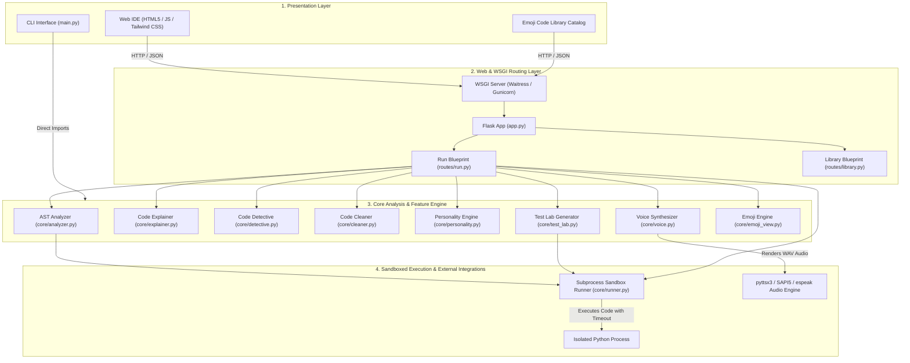
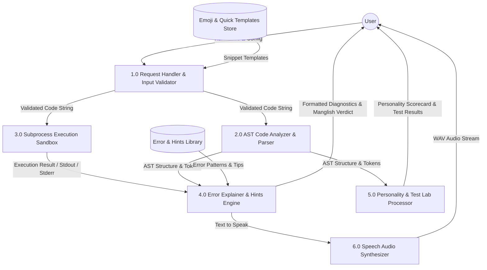
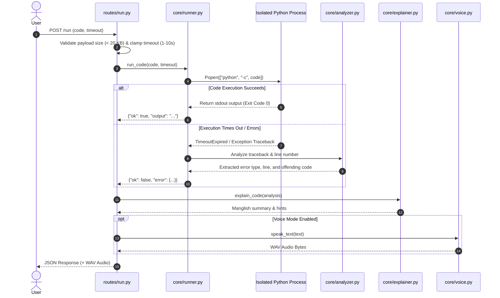

# AYYO.py — Malayalam Python Playground & Code Companion 🎯


---

## 📌 Basic Details

### Team Name: AYYO Tech
- **Project Name**: AYYO Malayalam Python Playground & Companion
- **Repository**: [https://github.com/Ann-Maria-Jaison/useless_project_temp.git](https://github.com/Ann-Maria-Jaison/useless_project_temp.git)

---

## 💡 Project Description

### What is AYYO?
**AYYO.py** is an interactive, full-stack Python playground and code companion designed with a hilarious Malayalam/Manglish twist. It goes beyond simple code execution by providing sandboxed runtime execution, AST-based static code analysis, automated refactoring, security inspection, personality profiling, automated unit test generation, emoji code visualization, and voice feedback synthesis via offline TTS.

### The Problem (That Nobody Asked to Solve)
Standard IDEs and compilers emit dry, intimidating error messages like `ZeroDivisionError: division by zero` or `IndexError: list index out of range`. Beginner developers often feel frustrated and lost when faced with cryptic stack traces.

### The Solution (That Everyone Needs!)
AYYO intercepts Python code and runtime errors, translating them into friendly, witty Manglish commentary ("*Ayyo! Zero base division math rule breaking detected bro!*"), complete with code cleanup recommendations, personality scorecards, auto-generated unit tests, and spoken voice responses!

---

## ✨ Key Features

| Mode / Feature | Icon | Description |
| :--- | :---: | :--- |
| **Diagnose Mode** | 🔴 | Runs code inside a sub-second isolated sandbox. Translates runtime errors into friendly Manglish explanations with actionable fixes. |
| **Code Explainer** | 🧠 | Parses Abstract Syntax Trees (AST) to explain variables, loops, functions, and predictable outputs in plain English & Manglish. |
| **Code Detective** | 🕵️ | Audits code for security smells, infinite loops, dead code, and suspicious patterns. |
| **Code Cleaner** | 🧹 | Formats messy Python code, adds missing docstrings, cleans unnecessary print statements, and normalizes formatting. |
| **Personality Profiler**| 🧬 | Analyzes coding style and assigns scores across 5 traits: *Risk*, *Patience*, *Overengineering*, *Drama*, and *Curiosity*. |
| **Test Lab** | 🧪 | Automatically generates dynamic unit test cases for user functions and executes them against the sandbox. |
| **Voice Synthesis** | 🔊 | Converts diagnostic feedback into spoken audio using `pyttsx3` offline speech synthesis engine. |
| **Emoji View & Palette** | 🎨 | Renders Python code as emoji visual tokens and provides interactive quick-program templates. |

---

## 🏗️ System Architecture

AYYO is designed as a modular 4-layer architecture comprising a responsive Web Frontend / CLI, a Flask REST Routing Layer, a Core Static & Runtime Analysis Engine, and an Isolated Subprocess Sandbox.



---

## 🔄 Data Flow Diagrams (DFD)

### DFD Level 0: Context Diagram
The Context Diagram represents the high-level interaction between the User and the AYYO System.

```mermaid
graph LR
    User(("User / Developer"))
    
    subgraph AYYO_System ["AYYO Python Playground System"]
        SystemProcess["AYYO Code Companion Engine"]
    end

    User -->|1. Submit Python Code / Execution Request| SystemProcess
    User -->|2. Select Mode (Diagnose, Explain, Test, Clean)| SystemProcess
    
    SystemProcess -->|3. Return Execution Output & Error Diagnostics| User
    SystemProcess -->|4. Return AST Analysis & Code Personality| User
    SystemProcess -->|5. Stream Voice Audio Feedback (WAV)| User
```

---

### DFD Level 1: Subsystem Data Flow Diagram
DFD Level 1 illustrates how user data moves across internal processing modules.



---

### DFD Level 2: Sandboxed Code Execution & Error Pipeline
DFD Level 2 details the exact processing steps when a code execution request is processed.



---

## 📂 Project Structure & Component Breakdown

```
ayyo/
├── app.py                  # Flask Application Factory & Server Entrypoint (Dev)
├── wsgi.py                 # Production WSGI Entrypoint (Waitress / Gunicorn)
├── main.py                 # Interactive Command Line Interface (CLI)
├── requirements.txt        # Python Dependencies (Flask, pyttsx3, waitress, gunicorn)
├── Dockerfile              # Production Docker Container Build Specification
├── docker-compose.yml      # Local Docker Compose Orchestration
├── Procfile                # Heroku / Railway / Render Deployment Process Descriptor
├── render.yaml             # Render Infrastructure-as-Code Manifest
├── .gitignore              # Ignored files (caches, environments, secrets)
├── README.md               # Complete Project Documentation
│
├── core/                   # Core Analysis & Business Logic Engine
│   ├── analyzer.py         # AST parser & code structure extractor
│   ├── autofix.py          # Auto-correction suggestion algorithms
│   ├── cleaner.py          # Code beautifier & refactoring engine
│   ├── detective.py        # Static security & smell inspector
│   ├── emoji_library.py    # Pre-built emoji program catalog
│   ├── emoji_palette.py    # Palette token mappings
│   ├── emoji_view.py       # Code-to-Emoji visual parser
│   ├── errors.py           # Custom error classifier & translations
│   ├── explainer.py        # Code summarizer & expected output predictor
│   ├── hints.py            # Helpful debugging tips provider
│   ├── personality.py      # Code personality trait scoring algorithm
│   ├── renderer.py         # Terminal output formatting utilities
│   ├── run.py              # Low-level execution helper
│   ├── runner.py           # Subprocess sandbox executor with timeout control
│   ├── sandbox.py          # Security restrictions & isolation rules
│   ├── test_lab.py         # Dynamic unit test generator & runner
│   └── voice.py            # pyttsx3 text-to-speech audio synthesizer
│
├── routes/                 # Web Route Blueprints
│   ├── __init__.py
│   ├── run.py              # Execution, analysis, personality & voice REST APIs
│   └── library.py          # Emoji library snippet endpoints
│
├── static/                 # Frontend Static Assets
│   ├── style.css           # Custom CSS styling
│   └── avatar.jpg          # AYYO Mascot Avatar
│
├── templates/              # HTML Web Views
│   ├── index.html          # Main Web IDE Playground interface
│   └── library.html        # Emoji Library catalog interface
│
└── tests/                  # Automated Test Suite
    ├── __init__.py
    └── test_ayyo.py        # Unit tests for core engines & Flask routes
```

---

## 📡 REST API Reference

| Endpoint | Method | Request Payload | Description |
| :--- | :---: | :--- | :--- |
| `/run` | `POST` | `{"code": "...", "timeout": 5}` | Executes Python code in sandbox and returns stdout/error. |
| `/analyze` | `POST` | `{"code": "..."}` | Returns static syntax/lint issues without running code. |
| `/explain` | `POST` | `{"code": "..."}` | Returns AST breakdown (variables, functions, loops) and Manglish take. |
| `/detective` | `POST` | `{"code": "..."}` | Audits code for security risks, suspicious activity, and audit scores. |
| `/cleaner` | `POST` | `{"code": "..."}` | Returns refactored, formatted code and list of modifications made. |
| `/personality` | `POST` | `{"code": "..."}` | Computes developer personality score distribution. |
| `/test-lab` | `POST` | `{"code": "..."}` | Generates automated unit test code for functions present in input. |
| `/test-lab/run` | `POST` | `{"code": "...", "tests": [...]}` | Executes generated unit tests against user code. |
| `/voices` | `GET` | *None* | Lists available system text-to-speech voices. |
| `/speak` | `POST` | `{"text": "...", "rate": 150}` | Returns a `audio/wav` binary stream of synthesized speech. |
| `/api/emoji-view` | `POST` | `{"code": "..."}` | Converts python code into line-by-line emoji visual representation. |
| `/api/emoji-palette`| `GET` | *None* | Returns emoji palette definitions and quick program templates. |

---

## ⚙️ Installation & Local Setup

### Prerequisites
- Python **3.10** or higher
- `pip` (Python package manager)
- *(Optional)* `espeak` and `ffmpeg` (for Linux voice synthesis)

### Step 1: Clone Repository
```bash
git clone https://github.com/Ann-Maria-Jaison/useless_project_temp.git
cd useless_project_temp
```

### Step 2: Create Virtual Environment & Install Dependencies
```bash
# Windows
python -m venv venv
venv\Scripts\activate

# Linux / macOS
python3 -m venv venv
source venv/bin/activate

# Install requirements
pip install -r requirements.txt
```

### Step 3: Run the Application

#### Option A: Run CLI Interface
```bash
python main.py
```

#### Option B: Run Web IDE (Development Mode)
```bash
python app.py
```
*Open [http://127.0.0.1:5000](http://127.0.0.1:5000) in your web browser.*

#### Option C: Run Production WSGI Server (Waitress)
```bash
python wsgi.py
```

---

## 🚀 Production Deployment Guide

### 1. Local / On-Premise WSGI Serving
The project uses `waitress` as a production-grade multi-threaded WSGI server on Windows/Linux:
```bash
python wsgi.py
```

### 2. Containerized Deployment (Docker & Docker Compose)
To run in a self-contained Linux environment with `espeak` TTS pre-installed:

```bash
# Build and run container in detached mode
docker-compose up -d --build
```
*Access the app at `http://localhost:5000`.*

### 3. Cloud Deployment (Render / Heroku / Railway)
- **Render**: Connect your GitHub repository. Render will automatically read `render.yaml` or `Dockerfile`.
- **Heroku / Railway / Fly.io**: Deploy directly. The platform will execute `gunicorn wsgi:app` specified in the [Procfile](file:///c:/Users/Ann/Desktop/ayyo/Procfile).

---

## 🧪 Testing & Verification

Run the automated unittest suite to verify all core engines and HTTP endpoints:

```bash
python -m unittest discover tests
```

**Test Output:**
```
.............
----------------------------------------------------------------------
Ran 13 tests in 0.129s

OK
```

---

## 📜 Team & Acknowledgments

- **Developed for**: TinkerHub Useless Projects 3.0 Hackathon
- **Made with**: ❤️, Python, Flask, and lots of Malayalam humor!


